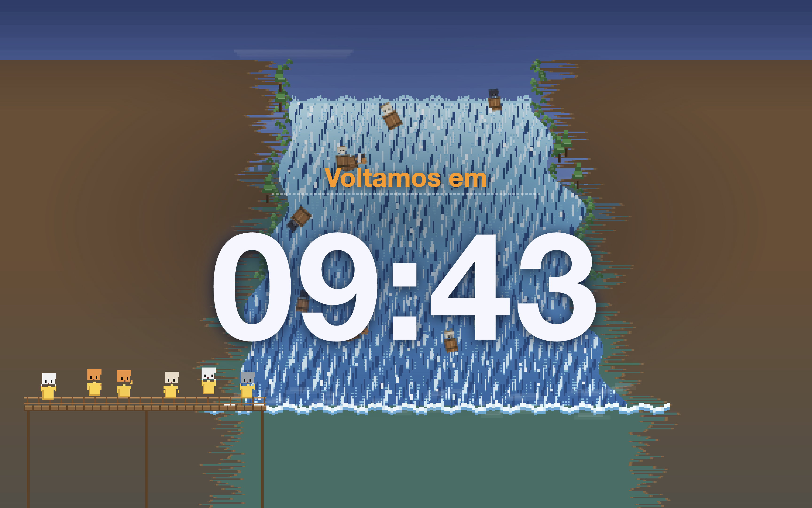

# Class Timer — Waterfall Edition

A single-file, browser-based countdown timer for the classroom, with an original
16-bit pixel-art waterfall scene animated in the background: tiny cats riding
barrels down a giant waterfall while a small crowd of raincoat-wearing cats
cheers from a wooden lookout.

Everything runs from **one HTML file** — no build step, no dependencies, no
external images, fonts or sounds. Just open it in a browser.


<!-- Optional: add a screenshot at docs/screenshot.png and this will render. -->

## Features

- **Countdown timer** with Start / Pause / Resume / Reset.
- **Configurable duration** in minutes (0–180).
- **Two languages**: Portuguese (Brazil) and English, switchable on the fly.
- **Three display modes:**
  - **Welcome** — "Welcome to the ___" with an editable course-name field and a
    "Class starts in" line above the timer.
  - **Coffee Break** — "Coffee Break, we'll be back in".
  - **Other** — a free-text field to type anything about the lab/activity.
- **Editable on-screen text** — the course name (Welcome) and the free text
  (Other) are large text areas that grow as you type.
- **Fullscreen mode** (great for projecting in class) — the control bar hides
  automatically in fullscreen.
- **Visual states** — the timer turns orange in the final minute and blinks red
  when it reaches zero.
- **Original pixel-art background** — a procedurally drawn waterfall scene (see
  below). A subtle dark scrim keeps the timer perfectly readable over the art.

## Getting started

1. Download `timer-waterfall.html`.
2. Double-click it (or open it in any modern browser).

That's it. There is no installation and no server required.

## Usage

The control bar at the top has everything:

| Control | What it does |
| --- | --- |
| **Language / Idioma** | Switches the whole interface between English and Portuguese (BR). |
| **Mode / Modo** | Chooses Welcome, Coffee Break, or Other. |
| **Minutes / Minutos** | Sets the countdown length. Editing it while stopped resets the timer; while running, the countdown keeps going. |
| **Start** | Starts or pauses the countdown. |
| **Pause** | Pauses the countdown. |
| **Reset** | Stops and resets to the configured minutes. |
| **⛶** | Toggles fullscreen. |

In **Welcome** mode, click the dashed field to type the course name. In
**Other** mode, click the field to type your own message. Both fields are
centered and scale up on screen.

## The background scene

The scene is an original illustration drawn entirely with code on a single
low-resolution `<canvas>` that is scaled up with nearest-neighbour filtering for
a crisp 16-bit look. It is layered back-to-front:

1. Sky gradient, distant hills and haze.
2. The river feeding the top of the falls and an irregular waterfall crest.
3. The falling water — organic light/dark ribbons, foam and mist.
4. Natural side banks (rock, earth, bushes, small trees), rising base mist,
   tiny barrels carrying cats, and a foreground wooden lookout with a small
   irregular group of yellow-raincoat cats cheering.

The barrels vary in cat color/pattern (orange, gray, white, black, siamese,
calico), mood, speed, sway and rotation; some briefly disappear into the foam
and reappear. Randomness (via JavaScript) keeps the animation from looping
identically.

## Compatibility

Works in any modern browser (Chrome, Firefox, Safari, Edge). Fullscreen uses the
standard Fullscreen API. No internet connection is needed after you have the
file.

## Project structure

```
timer-waterfall.html   # the entire app: HTML + CSS + JS in one file
README.md              # this file
LICENSE                # MIT license
```

## Customization

Everything lives in the single HTML file:

- **Interface text and translations** — the `T` object near the top of the
  `<script>` holds all Portuguese/English strings.
- **Colors and layout** — the CSS variables in `:root` and the `.controls` /
  `.stage` / `.timer` rules.
- **The waterfall scene** — the self-contained `waterfallScene()` function at the
  bottom of the `<script>`. Its color palette, cloud/water behavior, number of
  barrels (`MAX_BARRELS`), and tourist count are all defined there.

## Notes on originality / licensing

All artwork is drawn procedurally from scratch. The project uses no third-party
sprites, images, fonts, sounds, or assets, and does not reproduce characters,
logos, or scenes from any existing game or other work. The waterfall is a
stylized, generic interpretation of the classic idea of adventurers going over a
big waterfall in barrels.

## License

Released under the [MIT License](LICENSE).
